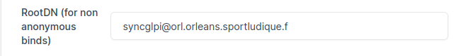

# Liaison GLPI à L'AD (LDAP)

---

## 1. Création d'une liaison

Dans **Configuration** → **Authentification** → **LDAP Directory** → **Nouveau**


### Paramètres de Configuration

*   **Nom** : Active Directory - it-connect.local
*   **Serveur par défaut** : Oui
*   **Actif** : Oui
*   **Serveur** : `10.10.100.11` (ou `172.28.120.1` selon infra)
*   **Port** : `389`
*   **Filtre de connexion** :
    ```ldap
    (&(objectClass=user)(objectCategory=person)(!(userAccountControl:1.2.840.113556.1.4.803:=2)))
    ```
*   **BaseDN** : `DC=orl,DC=orleans,DC=sportludique,DC=fr`
*   **Utiliser bind** : Oui
*   **DN du compte** : `syncglpi@orl.orleans.sportludique.fr` (Compte de service AD)
*   **Mot de passe du compte** : *[Mot de passe du compte "Sync_GLPI"]*
*   **Champ de l'identifiant** : `userprincipalname` (optionnel)
*   **Champ de synchronisation** : `objectguid` (optionnel)


---

---

## 2. Phase de Test LDAP

Après avoir rempli le formulaire, effectuez un test pour vérifier la connexion.

Les 3 premières phases fonctionnent généralement correctement :
*   TCP stream (flux TCP)
*   Base DN
*   LDAP URI

### Gestion des Erreurs

#### Erreur : "Bind connection Authentication failed: Invalid credentials (49)"

C'est probablement une erreur dans le champ **Root DN** ou le mot de passe.



#### Erreur : "Strong(er) authentication required (8)"

GLPI veut utiliser LDAPS (LDAP sécurisé), mais le Contrôleur de Domaine ne l'autorise pas ou force une signature que GLPI ne fournit pas.

!!! warning "Solution"
    Il faut configurer le DC ou passer en LDAPS. Voir le guide : [Fixer l'erreur de LDAP](../Activedirectory/LDAP.md)

!!! danger "Sécurité"
    Utiliser LDAP simple (port 389) signifie que les identifiants transitent en **clair** sur le réseau. Ceci ne doit pas être utilisé en production définitive.

### Test Réussi

Si tout est correct, vous obtiendrez un résultat similaire :


